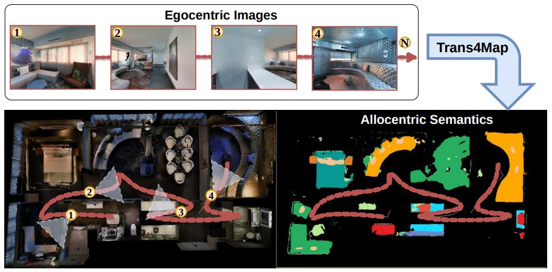

# Trans4Map
**Trans4Map: Revisiting Holistic Top-down Mapping from Egocentric Images to Allocentric Semantics with Vision Transformers**

Chang Chen, [Jiaming Zhang](https://jamycheung.github.io/), [Kailun Yang](https://yangkailun.com/), Kunyu Peng, [Rainer Stiefelhagen](https://cvhci.anthropomatik.kit.edu/people_596.php)



### Introduction

In this work, we propose an end-to-end one-stage Transformer-based framework for Mapping, termed Trans4Map. Our egocentric-to-allocentric mapping process includes three steps: (1) the efficient transformer extracts the contextual features from a batch of egocentric images; (2) the proposed Bidirectional Allocentric Memory (BAM) module projects egocentric features into the allocentric memory; (3) the map decoder parses the accumulated memory and predicts the top-down semantic segmentation map.

More detailed can be found in our [arxiv](https://arxiv.org/pdf/2207.06205.pdf) paper.


### Installation
#### To create conda env:
    conda create -n Trans4Map python=3.7
    conda activate Trans4Map
    cd /path/to/Trans4Map
    pip install -r requirements.txt
 To get RGBD renderings in Matterport3D dataset, we need to install [Habitat-sim](https://github.com/facebookresearch/habitat-sim) and [Habitat-lab](https://github.com/facebookresearch/habitat-lab).
 To ensure consistency with our working environment，please install the following version Habitat-sim == 0.1.5 and Habitat-lab == 0.1.5.

### Datasets
You can prepare the training and test dataset in the same way as [SMNet](https://github.com/vincentcartillier/Semantic-MapNet).
* ```data/paths.json``` has the given trajectories which are manually recorded by SMNet.
* The semantic top-down ground truth are also available : [GT](https://drive.google.com/drive/folders/1aM9vfDckY6K81mrVhVLmEX5rKZ2B1Q5r?usp=sharing), please place them under ```data/semmap```.
* Our project is working with [Matterport3D](https://niessner.github.io/Matterport/) dataset and [Replica](https://github.com/facebookresearch/Replica-Dataset) dataset, please download them and place them under ```data/mp3d or data/replica```.

### Training and Evaluation
To train our Trans4Map with different backbones, run:
    
    python train.py 
To generate the test result, run the following code:

    python build_test_date_feature.py
    python test.py
To obtain the mIOU and mBF1, run:

    python eval/eval.py
    python eval/eval_bfscore.py

### Main results on Matterport3D with pretrained models
| Method    | Backbone   | mIOU(%) | weight                                                                         |
|-----------|------------|---------|--------------------------------------------------------------------------------|
| ConvNeXt | ConvNeXt-T | 35.91   |                                                                                |
| ConvNeXt | ConvNeXt-S | 36.49   |                                                                                |
| FAN       | FAN-T      | 31.07   |                                                                                |
| FAN       | FAN-S      | 34.62   |                                                                                |
| Swin      | Swin-T     | 34.19   |                                                                                |
| Swin      | Swin-S     | 36.80   |                                                                                |
| Trans4Map | MiT-B2     | 40.02   | [B2](https://drive.google.com/drive/folders/17Y0Tz107vwocONd4ddBXFAU3n0236KNK) |
| Trans4Map | MiT-B4     | 40.88   | [B4](https://drive.google.com/drive/folders/17Y0Tz107vwocONd4ddBXFAU3n0236KNK) |                                                                  |

## License

This repository is under the Apache-2.0 license. For commercial use, please contact with the authors.


## Citations

If you are interested in this work, please cite the following work:

```text
@article{chen2022trans4map,
  title={Trans4Map: Revisiting Holistic Top-down Mapping from Egocentric Images to Allocentric Semantics with Vision Transformers},
  author={Chen, Chang and Zhang, Jiaming and Yang, Kailun and Peng, Kunyu and Stiefelhagen, Rainer},
  journal={arXiv preprint arXiv:2207.06205},
  year={2022}
}
```
